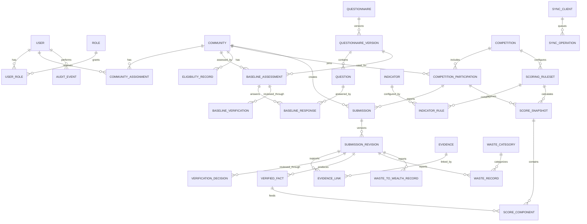

# PostgreSQL Database Design — Initial Domain Model

## 1. Design goals

The data model must support:

- Multiple roles per user
- Community-scoped access
- Versioned questionnaires and immutable assessment responses
- Separation of baseline eligibility from competition activation
- Versioned submissions and evidence
- Verified-data-only scoring
- Configurable scoring rules and waste categories
- Offline idempotency and conflict detection
- Complete audit history

This is a logical design, not yet an executable database migration.

Schema changes will be implemented through Flyway migrations. Production must validate or apply approved migrations during deployment and must not use Hibernate schema auto-update.

## 2. High-level ERD

## 3. Identity and authorization

### `users`

| Column | Type | Notes |
| --- | --- | --- |
| id | UUID | Primary key |
| email | VARCHAR | Unique when present |
| phone | VARCHAR | Unique when used for login |
| password_hash | VARCHAR | Never store plain-text passwords |
| display_name | VARCHAR | Required |
| status | VARCHAR | INVITED, ACTIVE, LOCKED, DISABLED |
| created_at | TIMESTAMPTZ | Required |
| updated_at | TIMESTAMPTZ | Required |
| row_version | BIGINT | Optimistic concurrency |

### `refresh_sessions`

Stores server-controlled refresh sessions with user, hashed opaque token identifier, token-family identifier, creation/expiry timestamps, rotation metadata, revocation metadata, and limited device/session information. Reuse of a rotated token revokes its token family. Raw refresh tokens are never stored.

### `roles`

Seeded codes: `ADMIN`, `COMMUNITY_OFFICER`, `FIELD_OFFICER`, `M_AND_E`.

### `user_roles`

Many-to-many assignment with `user_id`, `role_id`, `granted_by`, `granted_at`, and optional `revoked_at`.

### `community_assignments`

Links a user to a community with assignment type, start/end dates, status, and audit metadata. Field Officer access derives from active assignments. Community Officer context derives from an active Community Officer assignment.

## 4. Community and eligibility

### `communities`

Stores identity and profile information, location, internal visibility, public profile status, lifecycle status, timestamps, and `row_version`.

Initial registration fields:

- `name` — required
- `ward`
- `chiefdom`
- `district`
- `estimated_households`
- `estimated_population`
- `estimated_women`
- `estimated_youth_15_35`
- `estimated_persons_with_disabilities`
- `demographics_as_of_date`
- `demographics_source`
- `community_leader_name`
- `community_leader_phone`
- `community_focal_person_name`
- `community_focal_person_phone`

Counts use non-negative integers. Individual demographic subgroup counts cannot exceed estimated population when both are supplied, but subgroup totals are not added together because categories may overlap. Contact names and phone numbers are restricted operational data.

Community rows do not store a competition rank or mutable calculated score.

### `eligibility_records`

Records eligibility decisions independently from competition enrollment:

- Community
- Baseline assessment/revision used
- Decision: ELIGIBLE, NOT_ELIGIBLE, SUSPENDED, REVOKED
- Reason
- Effective dates
- Deciding user
- Decision timestamp

Eligibility history is append-only.

## 5. Questionnaire and baseline assessments

### `questionnaires`

Defines a stable questionnaire identity, such as `COMMUNITY_BASELINE`.

### `questionnaire_versions`

Stores version number, status (`DRAFT`, `PUBLISHED`, `RETIRED`), publication timestamp, and effective dates. A published version is immutable.

### `questions`

Each version owns ordered question definitions:

- Stable question code
- Section code and display order
- Prompt and help text
- Response type
- Required flag
- Validation configuration
- Options configuration
- Evidence requirement configuration
- Conditional-display configuration
- Score/rubric guidance where applicable

Question definition configuration may use `JSONB`, but frequently queried response data must use typed response columns rather than opaque documents alone.

### `baseline_assessments`

Stores community, questionnaire version, assessor, lifecycle status, assessment time/location, submission timestamps, current revision number, and optimistic `row_version`.

### `baseline_responses`

Stores one response per assessment revision and question. Typed value columns support text, integer, decimal, boolean, date, selected option, and structured location. Original unit and normalized value are retained for measurements.

Assessment revisions must be immutable after submission. Corrections create another revision associated with the same logical assessment.

### `baseline_verifications`

Append-only decisions containing reviewer, decision, reason/comments, decision time, and assessment revision. A constraint or service-level authorization rule prevents an assessor from verifying their own assessment.

## 6. Competitions and participation

### `competitions`

Stores name, description, start/end dates, status, public visibility, and configuration metadata.

### `competition_participations`

Links an eligible community to a competition. Stores enrollment and activation status/dates. The combination of `competition_id` and `community_id` is unique.

Rankings, submissions, and scores reference participation rather than only community, preserving separation across competitions.

## 7. Reporting and Waste-to-Wealth

### `submissions`

A stable logical record containing:

- Client-generated UUID
- Participation/community
- Submission type
- Owner/creator
- Current workflow state
- Current revision number
- Offline source metadata
- Timestamps and `row_version`

### `submission_revisions`

Immutable submitted versions with payload metadata, submitter, submission time, revision reason, and link to the previous revision.

Domain-specific tables reference a submission revision. Initial types include:

- Activity
- Waste collection
- Segregation
- Weighing
- Recycling
- Upcycling
- Waste sale
- Product
- Enterprise
- Revenue/cost
- Job and participation
- Innovation

### `waste_categories`

Admin-configurable categories with stable code, name, status, display order, and effective dates. Initial values are Plastic and Organic.

### `waste_records`

Stores waste category, activity date, original quantity/unit, normalized kilograms, measurement method, weighing status, location, and source submission revision.

### `waste_to_wealth_records`

Provides the common parent for sales, recycling, upcycling, products, enterprises, financial outcomes, jobs, and innovations. Specialized child tables hold type-specific fields and avoid one very wide nullable table.

Money uses `NUMERIC(19,2)` with currency code. Quantities use fixed-precision `NUMERIC`.

## 8. Evidence and verification

### `evidence`

Stores:

- UUID
- Storage provider and object key
- Original filename and media type
- Byte size and integrity checksum
- Evidence type
- Captured timestamp and GPS where applicable
- Uploader
- Malware/validation status
- Sensitivity and public-visibility classification
- Retention status

The database does not store large file contents. The initial production storage provider is private Cloudflare R2 through its S3-compatible interface.

### `evidence_links`

Links evidence to a specific baseline or submission revision with purpose and requirement code. Evidence must never float without ownership/context.

### `verification_decisions`

Append-only reviewer decisions for submission revisions: APPROVED, REJECTED, or CORRECTION_REQUIRED. Records reviewer comments, decision timestamp, and structured reason codes.

### `verified_facts`

Materialized, traceable facts created from approved revisions. Each fact records indicator-relevant value, unit, period, community/participation, source revision, verification decision, and validity status.

Scores consume verified facts rather than unreviewed submission data.

## 9. Scoring

### `indicators`

Stable definitions grouped into the six competition categories.

### `scoring_rulesets`

Versioned configurations belonging to a competition. Published rulesets are immutable.

### `indicator_rules`

Defines rule type (`BINARY`, `QUANTITATIVE`, `RUBRIC`), weight, formula/configuration, required evidence, caps/floors, effective period, and indicator linkage.

### `score_snapshots`

Stores calculated total/category scores for a participation and calculation period, with ruleset version, calculation time, publication status, and calculation checksum.

### `score_components`

Stores each indicator result, inputs, formula version, awarded points, and traceability to verified facts.

Rank is derived from published snapshots and the configured tie-break sequence. Historical snapshots are never rewritten after a ruleset change.

## 10. Offline synchronization

### `sync_clients`

Identifies an installed client/device for a user, without treating the device identifier as authentication.

### `sync_operations`

Records idempotency key, client operation ID, target aggregate, operation type, base row version, processing status, server result, and timestamps.

Every mutating offline-capable API requires an idempotency key. Unique constraints prevent duplicate processing. A mismatched base row version returns a conflict and preserves both versions for resolution.

## 11. Audit

### `audit_events`

Append-only events containing actor, action, aggregate type/ID, timestamp, request correlation ID, reason, and safe before/after change metadata.

Audit coverage includes:

- Role and assignment changes
- Community lifecycle changes
- Baseline submission and verification
- Eligibility and competition activation
- Submission revisions and verification decisions
- Scoring-rule publication and calculations
- Public visibility changes
- Evidence access and retention actions where required

## 12. Required database conventions

- UUID identifiers for records created offline or exposed through APIs
- `TIMESTAMPTZ` for stored timestamps
- UTC storage with local-time rendering in clients
- `NUMERIC`, not floating point, for money and official quantities
- Foreign keys and explicit delete behavior
- Unique constraints for business identities and idempotency
- Check constraints for bounded ratings and non-negative quantities
- Optimistic row versions on mutable aggregates
- Soft lifecycle states instead of deleting audited operational records
- Flyway database migrations; never rely on schema auto-update in production
- Indexes on foreign keys, statuses, review queues, competition periods, and audit lookup fields

## 13. Open design items

The following must be completed before migrations are implemented:

- Exact scoring formulas and calculation periods
- Evidence retention periods
- Personal-data retention and anonymization rules
- Geographic structure for districts and communities
- Reporting/export requirements
