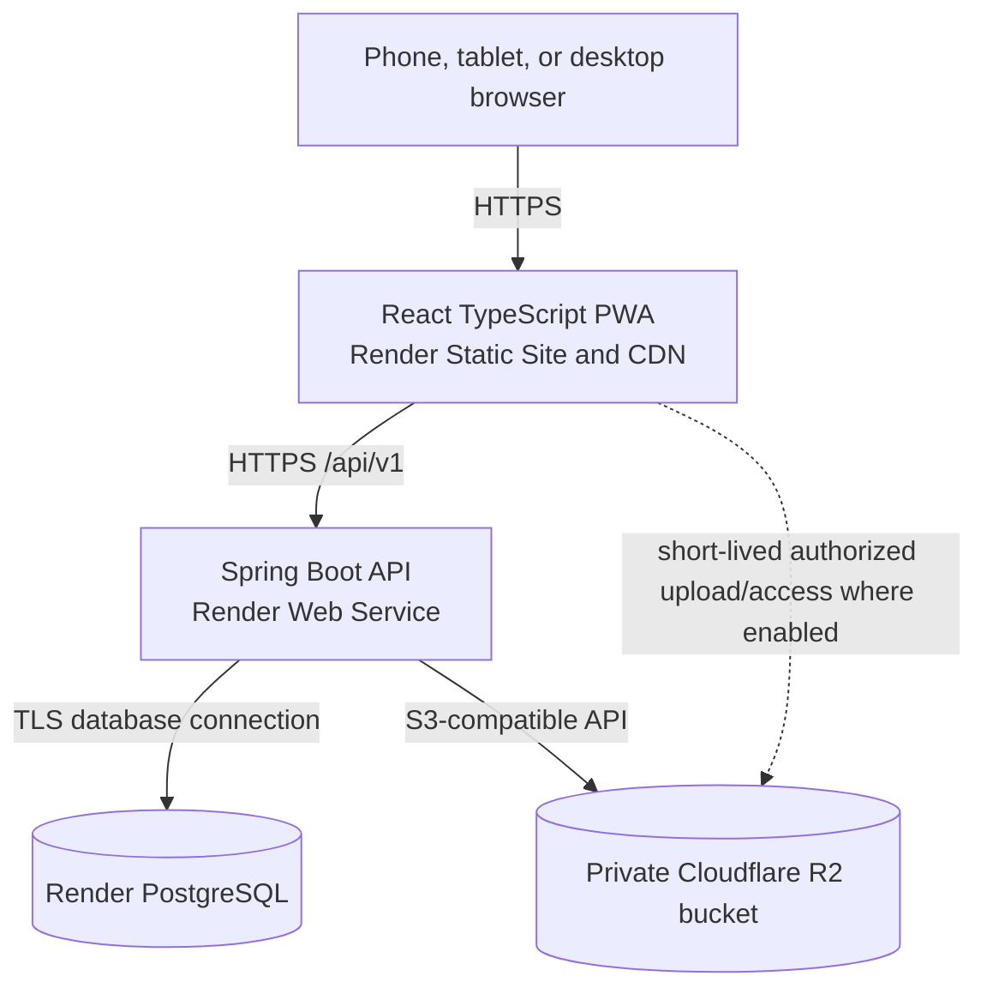

# System and Deployment Architecture

## 1. Approved technology and hosting decisions

| Concern | Approved choice |
| --- | --- |
| Frontend | React, TypeScript, Vite, mobile-first PWA |
| Frontend hosting | Render Static Site |
| Frontend previews | Vercel Preview Deployments |
| Backend | Java 21 and Spring Boot |
| Backend hosting | Render Web Service |
| Database | Managed Render PostgreSQL |
| Schema management | Flyway migrations |
| Evidence storage | Private Cloudflare R2 through the S3-compatible API |
| API style | Versioned REST API under `/api/v1` |
| Authentication | Short-lived JWT access token and rotating opaque refresh session |
| Offline storage | Browser IndexedDB with durable synchronization queue |
| Identifiers | UUIDs for API/offline-facing records |

These choices target the MVP and initial rollout of approximately 20 communities. Application boundaries remain provider-neutral so hosting can change later without redesigning the domain.

Vercel is approved for live frontend branch/commit previews. The Spring Boot API remains on Render. Integrated authenticated staging uses stable controlled frontend/API origins so refresh-cookie and CORS policies do not depend on arbitrary preview URLs.

## 2. Runtime architecture



The browser never receives database credentials or permanent object-storage credentials.

## 3. Repository responsibility

### `greenfuture`

- Spring Boot REST API
- Authentication and authorization
- Domain workflows and validation
- PostgreSQL entities and Flyway migrations
- Evidence metadata and signed R2 operations
- Verification, scoring, audit, exports, and synchronization
- Backend tests and deployment configuration
- Authoritative shared specifications under `docs/`

The backend code follows the package-by-feature modular-monolith rules in `backend-code-structure.md`.

### `greenfuture-frontend`

- React/TypeScript application
- Public portal and authenticated role workspaces
- Responsive forms and dashboards
- PWA manifest and service worker
- IndexedDB drafts, evidence queue, synchronization, and conflicts
- Typed API client
- Frontend and end-to-end tests
- Static-site deployment configuration

## 4. Request and data flow

### Normal API request

1. The PWA sends an HTTPS request with a short-lived bearer access token.
2. Spring Security authenticates the token and reloads/enforces relevant authorization and scope.
3. The domain service validates the command and workflow transition.
4. PostgreSQL is updated transactionally.
5. An audit event and request correlation ID are recorded where required.
6. The API returns a dedicated response model.

### Evidence upload

1. The client requests an evidence upload session from Spring Boot.
2. The API verifies user, community, revision, file metadata, and evidence policy.
3. The API creates evidence metadata and a constrained upload authorization.
4. The client uploads to private Cloudflare R2, directly when an approved signed-upload flow is used or through the API fallback.
5. The client confirms completion.
6. The API verifies metadata/checksum and marks the object available or rejected/quarantined.
7. The evidence is linked to an exact editable revision.

### Evidence access

1. The client requests access through the API.
2. The API applies role, community, revision, and sensitivity checks.
3. The API returns a short-lived signed R2 URL or streams the file when policy requires it.
4. The bucket remains private; object keys are not public permissions.

## 5. Authentication architecture

- Access tokens are JWTs with an approximate 15-minute lifetime.
- The frontend holds the access token in application memory.
- Refresh tokens are random opaque secrets delivered only through Secure, HttpOnly, SameSite cookies.
- PostgreSQL stores only hashed refresh-token/session data.
- Refresh tokens rotate on every successful refresh.
- Reuse of an already rotated token revokes the token family.
- Logout revokes the current refresh session.
- Password/security changes can revoke all user sessions.
- Offline drafts can remain locally available within policy, but server synchronization requires renewed authorization.

Production should route frontend and API through controlled application domains that support the cookie and CORS policy without weakening browser protections.

## 6. Environment model

### Local development

- Vite development server
- Local Spring Boot process
- Local PostgreSQL
- Local S3-compatible development storage or a dedicated non-production R2 bucket
- Development-only credentials outside source control

### Staging

- Render Static Site for staging frontend
- Render Web Service for staging API
- Separate staging PostgreSQL database
- Separate private staging R2 bucket
- Production-like security and migration flow
- Safe test data only

### Production

- Independent production frontend and backend services
- Managed production PostgreSQL with backups/recovery configured
- Dedicated private production R2 bucket
- Production domain, TLS, secrets, monitoring, and alerts
- No shared staging/production credentials or data stores

## 7. Deployment flow

```text
Feature branch
→ Pull request checks
→ Review and merge to main
→ Build and automated tests
→ Deploy to staging
→ Run Flyway migration validation/application
→ Smoke and workflow tests
→ Explicit production promotion
→ Health verification and rollback monitoring
```

Frontend and backend deploy independently. An API-breaking change requires compatibility sequencing so the deployed frontend and backend can coexist during rollout.

## 8. Configuration and secrets

Configuration is supplied by environment and secret management, including:

- Database connection details
- JWT signing/verification keys
- Refresh-session security settings
- Allowed origins and application domains
- R2 endpoint, bucket, scoped access key, and secret
- Upload limits and accepted types
- Logging/monitoring configuration
- Feature flags and public base URLs

Secrets, production passwords, private keys, and storage credentials must never be committed. R2 credentials use least privilege and are restricted to the required bucket/actions.

## 9. Database reliability

- Flyway owns schema history.
- Hibernate production schema mode validates mappings rather than updating the schema.
- Migrations are forward-reviewed and tested against staging backups/data shapes.
- Backups and point-in-time recovery settings are confirmed before production use.
- Restore procedures are tested, not merely assumed.
- Application deployment stops if required migrations fail.

## 10. Evidence reliability and privacy

- The R2 bucket is private.
- PostgreSQL stores evidence metadata, ownership, checksum, sensitivity, and retention state.
- Large file bytes are not stored in PostgreSQL.
- Object keys use non-guessable identifiers and do not contain unnecessary personal data.
- Files are validated before being accepted as available evidence.
- Evidence access is authorized at request time.
- Retention and deletion are audited.
- Staging and production evidence are physically separated.

## 11. Scaling approach

The initial architecture does not require microservices. One stateless Spring Boot application can serve the MVP while domain modules remain internally separated.

When workload grows:

- Render can increase API resources or instance count when the application is stateless.
- Static assets remain CDN-served.
- Evidence traffic remains outside the API when direct signed transfer is enabled.
- PostgreSQL indexes and queries are monitored before introducing caches.
- Long-running exports/scoring jobs may move to a worker/queue without changing public API contracts.

## 12. Observability

Minimum production visibility:

- API health and readiness endpoints
- Structured logs with request correlation IDs
- Authentication and authorization failure metrics without token leakage
- API latency and error rate
- Database connection and query health
- Evidence upload/validation failures
- Synchronization conflict and queue-age metrics
- Scoring/export job status
- Deployment and migration events

Logs must not contain passwords, tokens, evidence contents, sensitive buyer/payment information, or unnecessary personal data.

## 13. Recovery priorities

1. PostgreSQL records and audit history
2. Evidence objects and their metadata/link integrity
3. Authentication/session security state
4. Published competition and scoring records
5. Regenerable frontend/static assets

Recovery planning must account for consistency between PostgreSQL evidence metadata and R2 objects.

## 14. Remaining deployment decisions

The provider architecture is approved. Before production deployment, confirm:

- Organization-owned Render and Cloudflare accounts
- Billing owner and monthly budget
- Production/staging domains
- Render and R2 region/location choices
- Data-location or donor compliance requirements
- Evidence and personal-data retention periods
- Backup retention and recovery objectives
- Monitoring/alert destination and operational owner
- Expected evidence volume and file-size limits

The initial upload limits, retention framework, privacy controls, and production approval items are defined in `evidence-security-retention.md`.
