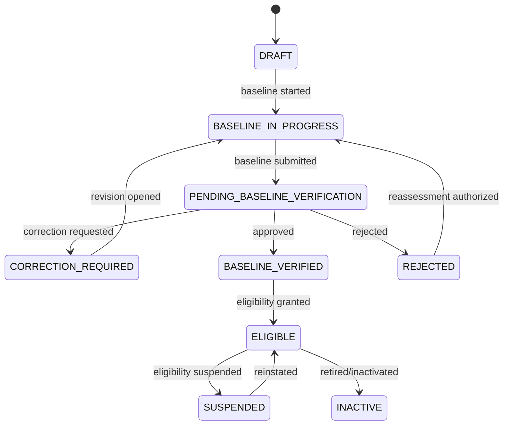
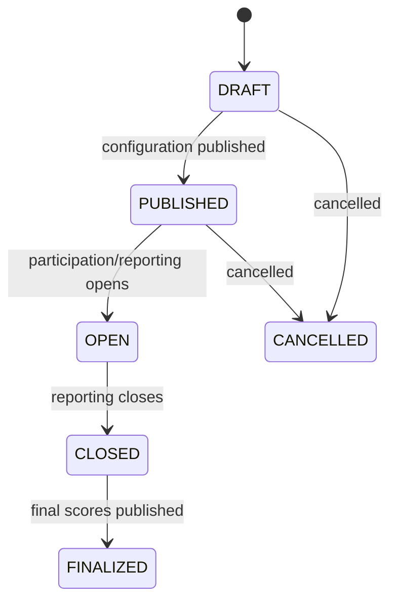
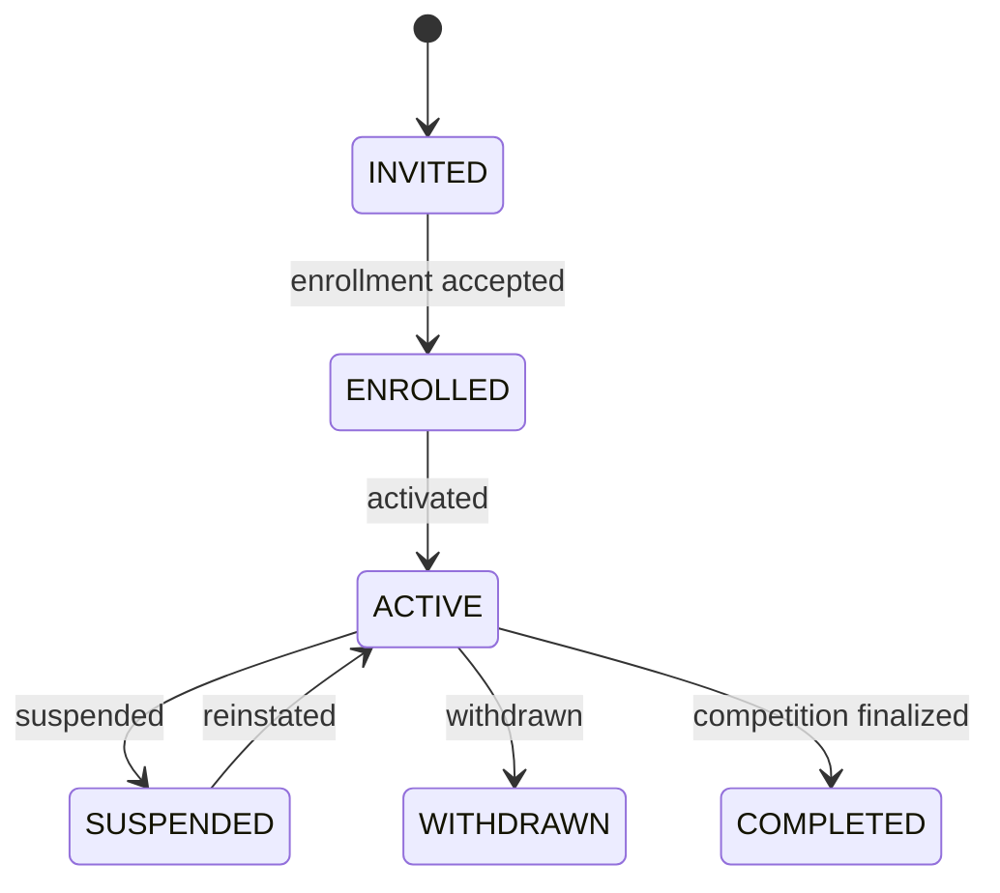
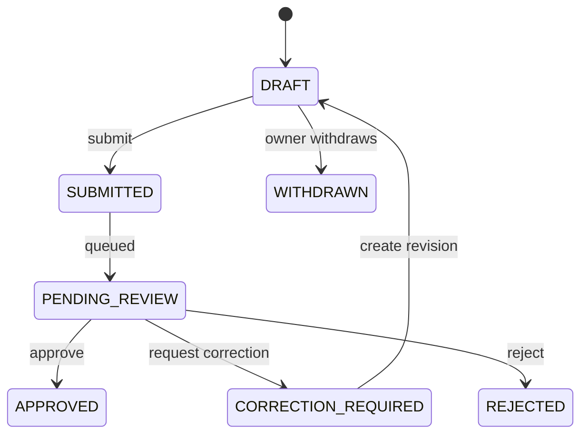

# Workflow and State-Transition Specification

## 1. General rules

1. State transitions occur through explicit commands, not arbitrary status updates.
2. Every accepted transition records actor, timestamp, prior state, new state, reason, and correlation ID.
3. Invalid transitions return a conflict response and do not mutate data.
4. Submitted and approved revisions are immutable.
5. Correction creates a new draft revision linked to the reviewed revision.
6. Transitions are idempotent when retried with the same idempotency key.

## 2. Community lifecycle



| From | To | Actor | Preconditions |
| --- | --- | --- | --- |
| DRAFT | BASELINE_IN_PROGRESS | Admin, M&E, assigned Field Officer | Community identity exists; assessor authorized |
| BASELINE_IN_PROGRESS | PENDING_BASELINE_VERIFICATION | Assessment owner/authorized user | Required answers/evidence complete; revision valid |
| PENDING_BASELINE_VERIFICATION | CORRECTION_REQUIRED | Admin or M&E reviewer | Reviewer differs from assessor/submitter; reason supplied |
| PENDING_BASELINE_VERIFICATION | BASELINE_VERIFIED | Admin or M&E reviewer | Separation of duties; verification checklist passes |
| PENDING_BASELINE_VERIFICATION | REJECTED | Admin or M&E reviewer | Separation of duties; rejection reason supplied |
| BASELINE_VERIFIED | ELIGIBLE | Admin | Verified baseline exists; eligibility checklist passes |
| ELIGIBLE | SUSPENDED | Admin | Reason and effective time supplied |
| SUSPENDED | ELIGIBLE | Admin | Reinstatement reason supplied; eligibility remains valid |
| ELIGIBLE | INACTIVE | Admin | No prohibited active dependency or explicit closeout process |
| REJECTED | BASELINE_IN_PROGRESS | Admin | Reassessment authorized and new revision created |

## 3. Baseline assessment revisions

```text
Draft revision
→ Submitted revision (locked)
→ Under Review
→ Verified / Correction Required / Rejected
```

- `Correction Required` creates the next draft revision from the reviewed values.
- The user edits only the new revision.
- Evidence can be retained, replaced, or added; prior links remain unchanged.
- Verification applies to one exact revision.
- Only a verified revision can support an eligibility decision.

## 4. Competition lifecycle



| Transition | Preconditions |
| --- | --- |
| DRAFT → PUBLISHED | Dates valid; published scoring ruleset totals 100; required indicators/categories configured |
| PUBLISHED → OPEN | Start condition reached or Admin explicitly opens |
| OPEN → CLOSED | End condition reached or Admin closes with audit reason |
| CLOSED → FINALIZED | Review window complete; scores calculated and approved for publication |
| DRAFT/PUBLISHED → CANCELLED | Admin reason supplied; no finalized results |

Published competition configuration changes create a new version where historical interpretation could change.

## 5. Competition participation



Activation requires an eligible community and a published/open competition. Suspending eligibility automatically prevents new participation submissions, but does not delete existing history.

## 6. Operational submissions



Submission rules:

- Draft editing is limited to its owner or specifically authorized user.
- Submission validates required fields and evidence for its type.
- Approval creates or refreshes traceable verified facts.
- Rejection does not delete the submission.
- A correction revision must reference the prior revision and reviewer request.
- Previously approved data is not silently changed; an approved correction supersedes it through validity dates/revision linkage.
- Withdrawal is allowed only before approval unless an Admin performs a separate audited invalidation.

## 7. Verification decision rules

A decision requires:

- Authorized Admin or M&E reviewer
- Reviewer different from creator and submitter
- Exact target revision
- Structured decision reason
- Comments when rejected or correction is required
- Verification checklist result
- Decision timestamp

An approval fails if mandatory evidence is missing, invalid, quarantined, or does not meet the submission type's evidence policy.

## 8. Evidence lifecycle

```text
Queued Locally
→ Uploading
→ Uploaded
→ Validating
→ Available / Rejected / Quarantined
→ Retained / Expired
```

- A submission cannot be submitted until mandatory evidence is successfully uploaded or an explicitly supported deferred-upload policy applies.
- Object replacement creates new evidence; it does not overwrite the old object.
- Deletion after retention expiry uses an audited retention process.

## 9. Scoring and publication workflow

```text
Verified Facts Available
→ Draft Calculation
→ Calculation Validated
→ Score Snapshot Approved
→ Published
→ Superseded by Later Snapshot
```

- Recalculation never rewrites an older snapshot.
- Draft calculations are visible only to authorized Admin/M&E users.
- Public leaderboard data comes only from published snapshots.
- Invalidated verified facts trigger a new calculation; they do not alter the old snapshot.

## 10. Offline synchronization states

```text
SAVED_OFFLINE
→ PENDING_SYNC
→ SYNCING
→ SYNCED / SYNC_FAILED / CONFLICT
```

| Result | Client behavior |
| --- | --- |
| SYNCED | Store server ID/version and remove completed operation from active queue |
| SYNC_FAILED | Retain payload/evidence references and retry according to backoff policy |
| CONFLICT | Preserve local and server versions; stop automatic overwrite and request resolution |

Authentication, validation, and authorization failures are not retried indefinitely. Network and transient server failures are retryable.

## 11. Status visibility

Every operational screen must show the current state, last transition time, responsible party where appropriate, and required next action. User-facing labels may be friendlier than internal status codes but must map unambiguously.

